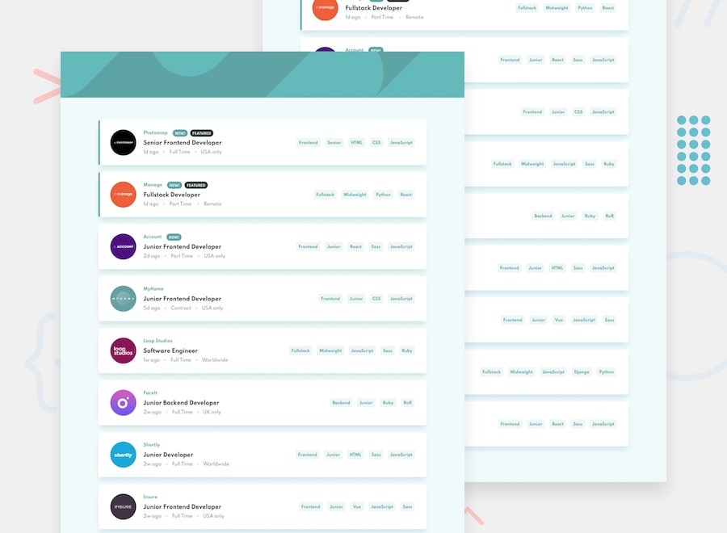

# Job Listener App

## ✍🏻 Descripción

Realize este challenge de [Frontend Mentor](https://www.frontendmentor.io/) con React trabajando con data estatica para listar y realizar los filtros, este es el tercer proyecto que realizo en mi aprendizaje de esta libreria.

## 🚀 Comenzando

Para iniciarlo debes clonarlo o descargarlo 😊, no olvides correr el comando 👇 para poder comenzar el proyecto.

```
npm install
```

Ingresar en la consola `npm start` para poner a correr el dev server. Navegar en `http://localhost:300/` y listo.

## 🎨 Demo

Puedes ver el demo aquí → <a href="https://job-listner-app.netlify.app/" target="_blank">Job Listener App</a>



## 🛠️ Construido con

-   HTML
-   CSS
-   JS
-   React

---

⌨️ con ❤️ por [Carlos Morales](https://github.com/cjosue15) 😊
